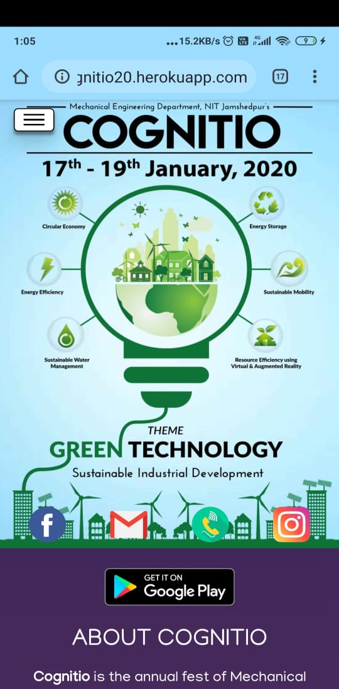
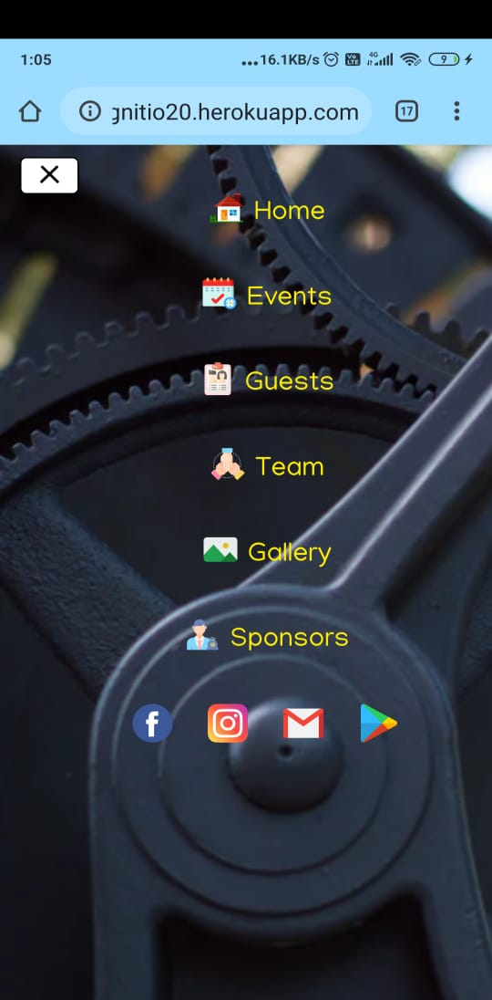
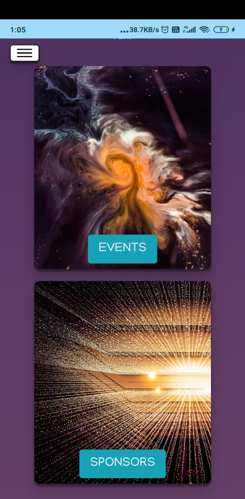
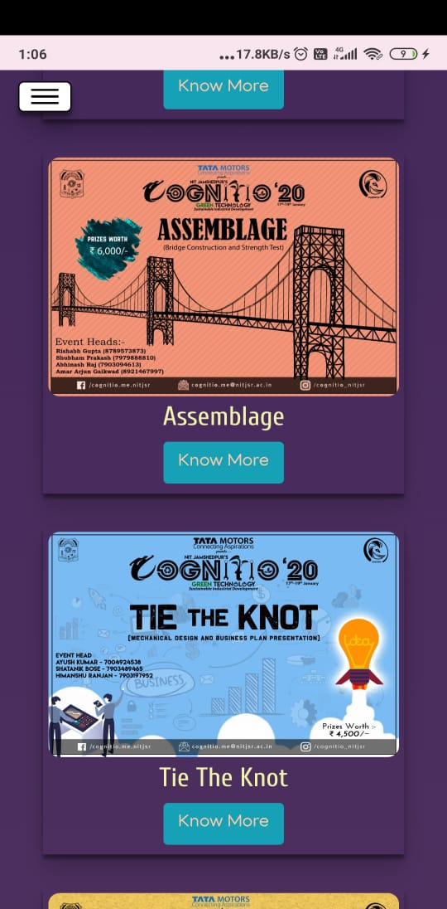
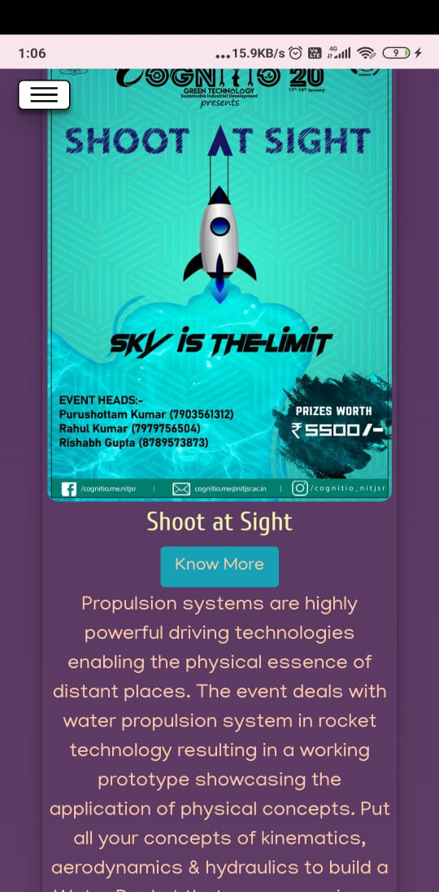
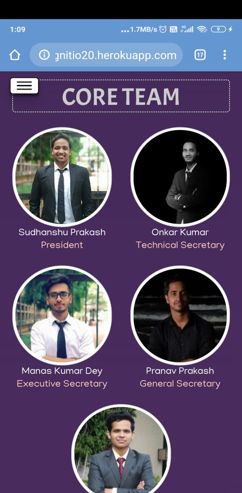
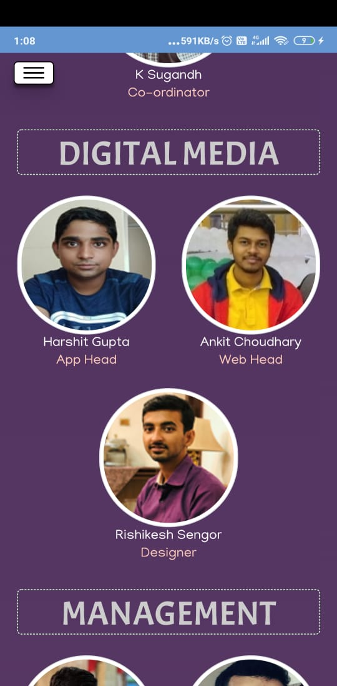
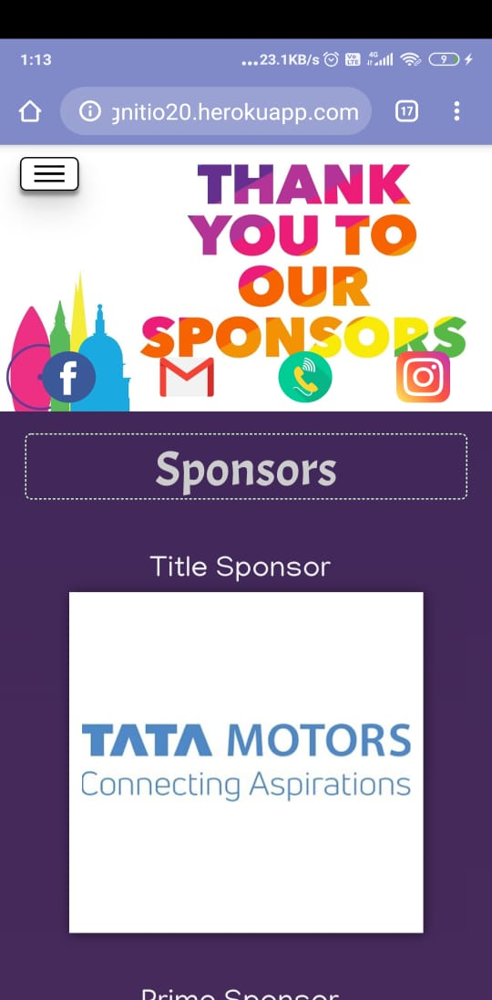
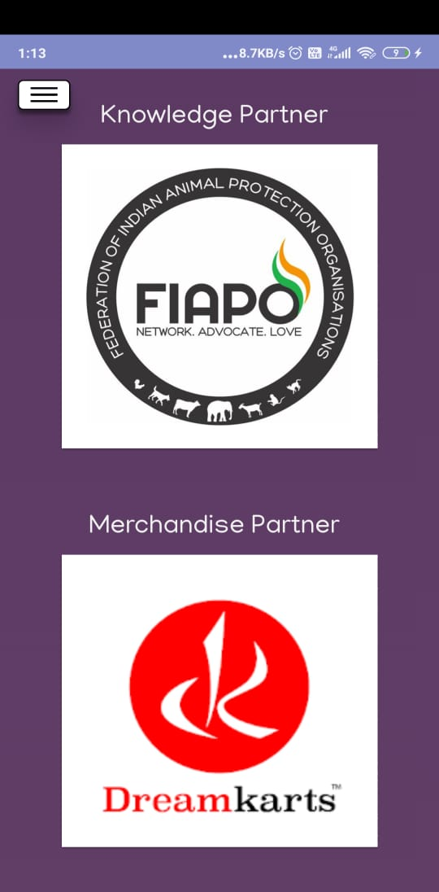

# Cognitio-20
### Website for Cognitio, the annual fest of Mechanical Engineering Department, N.I.T. Jamshedpur

*This website was meant for mobile phone users*

1. Top fixed navbar with side slider toggle menu using BOOTSTRAP4
	  
2. Cards with shake effect on hovering and AOS animations
	
3. Events page, card for each event
	*A description of event comes on clicking know more*
	 
4. Team page with categorised sub-teams, designed using *Bootstrap grid-system*
	 
	*No database has been used but all the sub teams have been dynamically created*
	*Check views/team.ejs for the code.*

5. Sponsors page, categorised sponsors, animated using AOS
	*The sponsor's logo have been placed on a white panel using a pinterest grid library*
	
	  

   